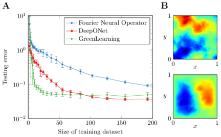

# Data-efficient PDE learning

[](https://doi.org/10.5281/zenodo.7701683)

This repository provides data and code for the paper N. Boull\'e, D. Halikias, and A. Townsend, [Elliptic PDE learning is provably data-efficient](https://www.pnas.org/doi/abs/10.1073/pnas.2303904120), PNAS, 2023. We compare the performance of three PDE learning techniques ([DeepONet](https://www.nature.com/articles/s42256-021-00302-5), [Fourier neural operator](https://arxiv.org/abs/2010.08895), and [GreenLearning](https://www.nature.com/articles/s41598-022-08745-5)) at recovering the solution operator of the 2D Poisson equation from input-output pairs with respect to the size of the training dataset.



### Requirements
The two requirement files provide the list of packages required to run the experiments in TensorFlow (DON) and PyTorch (FNO and GreenLearning). DON requires the [DeepXDE](https://github.com/lululxvi/deepxde) package V0.13.2.

### Instructions
1. Run the code ''data/generate_datasets.m'' to generate the training and testing datasets or download them from the [Zenodo repository](https://doi.org/10.5281/zenodo.7701683).
2. Run the codes ''deeponet.py'', ''fno.py'', and ''greenlearning.py'' in the src folder to reproduce the experiments of the paper.

### Results
The csv files in the results folder provide the average and standard deviation errors of the different neural networks over 10 runs with respect to the size of the training datasets.

### Acknowledgements
- The code ''src/deeponet.py'' and the data generation code are adapted from [codes](https://github.com/lu-group/deeponet-fno) written by Lu Lu.
- The code ''src/fno.py'' and ''utilities3.py'' are adapted from [codes](https://github.com/NeuralOperator/fourier_neural_operator) written by Zongyi Li.

### Citation
```
@article{boulle2023elliptic,
title={Elliptic PDE learning is provably data-efficient},
author={Boull{\'e}, Nicolas and Halikias, Diana and Townsend, Alex},
journal={Proceedings of the National Academy of Sciences},
issue={120},
number={39},
year={2023},
pages={e2303904120}
}
```
